## Data Modeling

#### ERD development based on CSV data
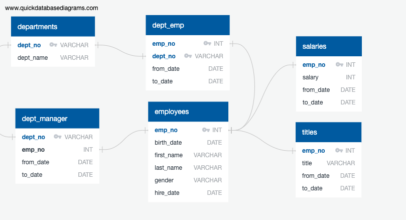

## Data Engineering

* Table schema were created based on the six CSV files. Data types, primary keys, foreign keys, and other constraints were specified.

* Imported each CSV file into the corresponding SQL table.

## Data Analysis

#### Employee Details
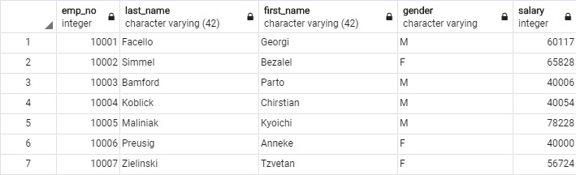

#### Employees who were hired in 1986.
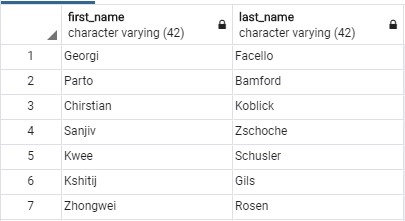

#### Department Manager Details
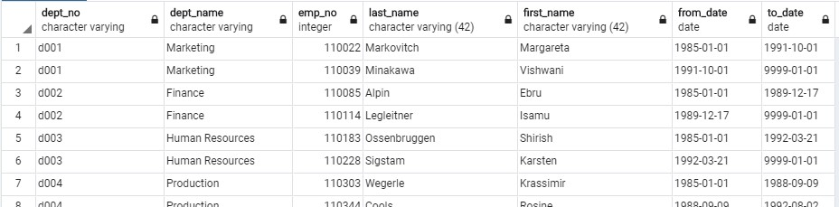

#### Employee Departments
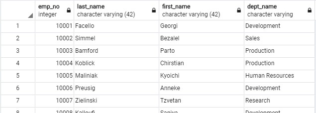

#### Employees whose first name is "Hercules" and last names begin with "B."
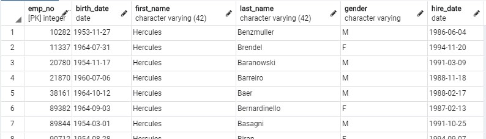

#### Sales Department Employees
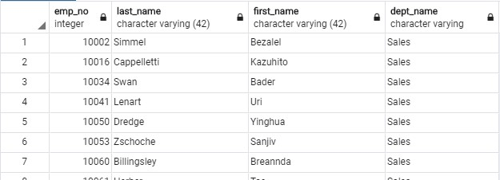

#### Sales and Development Employees
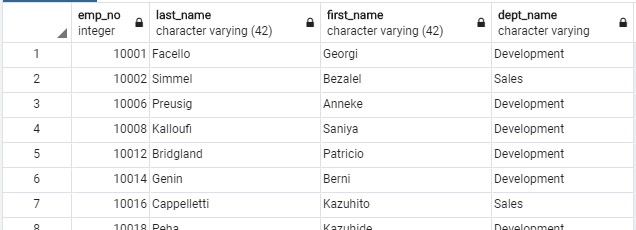

#### Last Name Counts
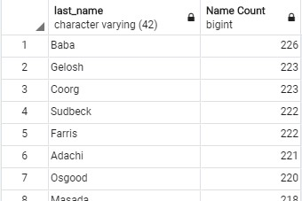

## Visualizations

#### Most common salary ranges for employees
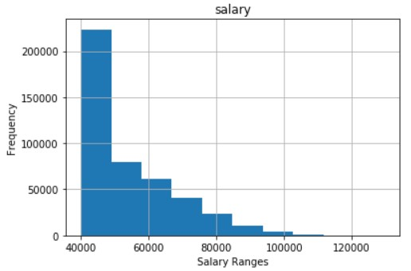

#### Average salary by title
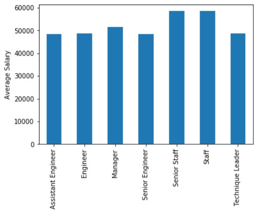
